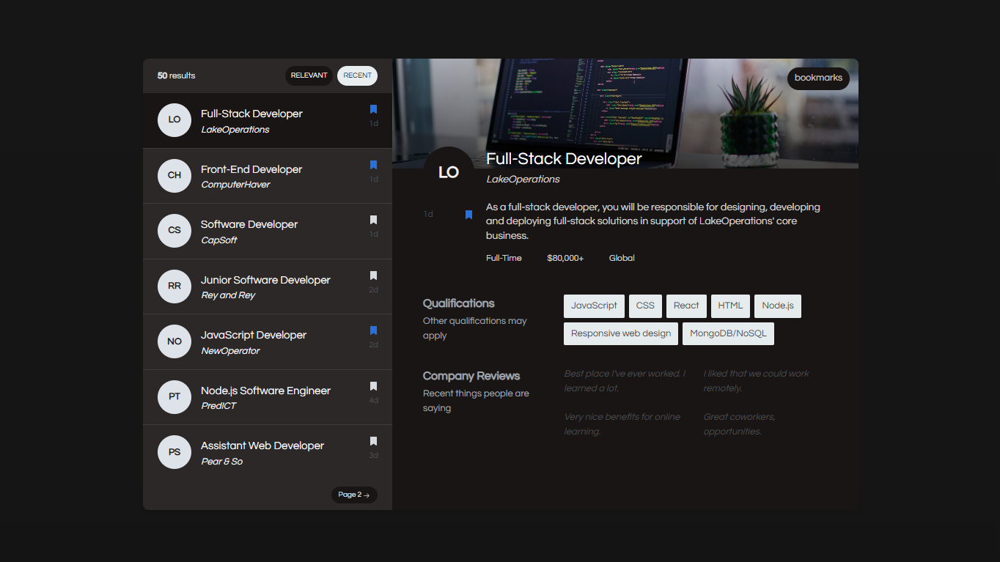

<a href="https://github.com/whosramoss/nextjs-remote-jobs">
  
  <h1 align="center">Nextjs Remote Jobs</h1>
</a>

<p align="center">
  Remote Jobs Dashboard
</p>

<div align="center">
  
  
  
  
  <br/>
  
  
  
</div>
<br/>

<br/>


## How to install 

```bash
  # Clone the project
  git clone https://github.com/whosramoss/nextjs-remote-jobs/

  # Go to the project directory
  cd nextjs-remote-jobs

  # Install dependencies
  npm install

  # Start the server 
  npm run dev
```

## How to build 
- Before generating the build, don't forget to update the [layout](./src/app/layout.tsx) file and set ```isLocalMetadata = false```.
- To generate a static compilation, the [next.config.mjs](./next.config.mjs) file must have the object below :
```bash
const staticbuild = {
  distDir: 'build',
  output: 'export',
  trailingSlash: true,
}
```
- Run the command:
```bash
  npm run build
```


## Contributing 
If you want to contribute to `nextjs-remote-jobs`, please make sure to review the [contribution guidelines](https://github.com/whosramoss/nextjs-remote-jobs/blob/master/CONTRIBUTING.md). This project makes use of [GitHub issues](https://github.com/whosramoss/nextjs-remote-jobs/issues) for
tracking requests and bugs.

## License 

MIT License. [LICENSE](./LICENSE)

## Author 

Gabriel Ramos ([@whosramoss](https://github.com/whosramoss))

